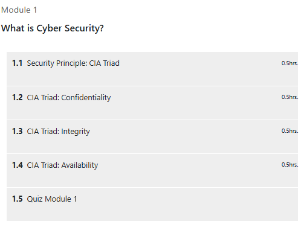
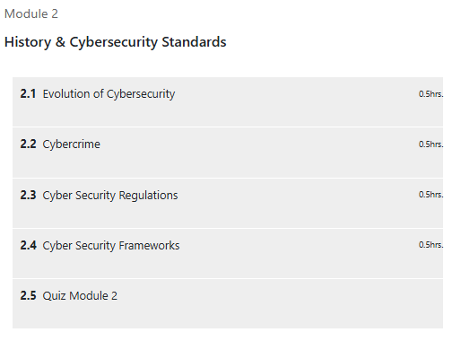

# 🛡️ Cyber Security – Henry Harvin Education

This repository contains **notes, labs, demos, guides, and certificate of completion** for the *Cyber Security – Henry Harvin Education* program.  
It provides a structured learning path on **networking, operating system security, cryptography, web security, malware analysis, ethical hacking, and cloud security**.

---

## 📚 Notes
- 📄 [01-introduction.md](./notes/01-introduction.md) – Introduction to Cyber Security  
- 📄 [02-networking-fundamentals.md](./notes/02-networking-fundamentals.md) – Networking fundamentals  
- 📄 [03-operating-system-security.md](./notes/03-operating-system-security.md) – OS security  
- 📄 [04-cryptography-basics.md](./notes/04-cryptography-basics.md) – Cryptography basics  
- 📄 [05-web-application-security.md](./notes/05-web-application-security.md) – Web app security  
- 📄 [06-malware-threats.md](./notes/06-malware-threats.md) – Malware threats  
- 📄 [07-security-operations.md](./notes/07-security-operations.md) – Security operations  
- 📄 [08-ethical-hacking-fundamentals.md](./notes/08-ethical-hacking-fundamentals.md) – Ethical hacking fundamentals  
- 📄 [09-cloud-security.md](./notes/09-cloud-security.md) – Cloud security  
- 📄 [10-final-assessment.md](./notes/10-final-assessment.md) – Final assessment  

---

## 🧪 Labs
- 🛡️ [network-security-lab.md](./labs/network-security-lab.md) – Network security lab  
- 🖥️ [os-security-lab.md](./labs/os-security-lab.md) – OS security lab  
- 🌐 [web-app-lab.md](./labs/web-app-lab.md) – Web application security lab  
- 🐛 [malware-lab.md](./labs/malware-lab.md) – Malware lab  
- 🚨 [incident-response-lab.md](./labs/incident-response-lab.md) – Incident response  

---

## 💻 Demo Exercises
- 📝 [demo-lab01.md](./demo/demo-lab01.md) – Networking demo  
- 📝 [demo-lab02.md](./demo/demo-lab02.md) – Web app demo  
- 📝 [demo-lab03.md](./demo/demo-lab03.md) – Malware demo  

---

## 📘 Guides
- ⚙️ [setup-environment.md](./guides/setup-environment.md) – Setting up environment  
- 📝 [reporting-guidelines.md](./guides/reporting-guidelines.md) – Reporting guidelines  

---

## 🔬 Research & Extras
- 📑 [case-studies.md](./extras/case-studies.md) – Case studies  
- 📆 [timeline.md](./extras/timeline.md) – Timeline  
- 📘 [resources.md](./extras/resources.md) – Resources  

---

## 📖 Docs
- 📘 [glossary.md](./docs/glossary.md) – Glossary  
- 📘 [index.md](./docs/index.md) – Index  
- 📘 [references.md](./docs/references.md) – References  
- 📘 [roadmap.md](./docs/roadmap.md) – Roadmap  
- 📘 [syllabus.md](./docs/syllabus.md) – Syllabus  

---

## 📸 Screenshots

| Step | Screenshot |
|------|------------|
| 🏫 Course Overview |  |
| 📚 Course Module |  |

---

## 📜 Certificate
🎓 [Cyber Security – Henry Harvin Education](./cert/Free%20Certificate%20Cyber%20Security%20-%20Henry%20Harvin%20Education.jpg)

---

## 📝 Personal Review
This course provided a **comprehensive foundation in cybersecurity**, covering key domains from networking and cryptography to web security and ethical hacking.  
The hands-on labs improved my practical skills, while the structured modules gave clarity on both **defensive and offensive techniques**.  

---

## ✍️ Author
**Thành Danh** – Red Team Learner & Security Researcher  

- GitHub: [@ngvuthdanhh](https://github.com/ngvuthdanhh)  
- Email: ngvu.thdanh@gmail.com  

---

## 📄 License
This project is licensed under the terms of the **MIT License**. See [LICENSE](./LICENSE) for full details.  
© 2025 ngvuthdanhh. All rights reserved.  
